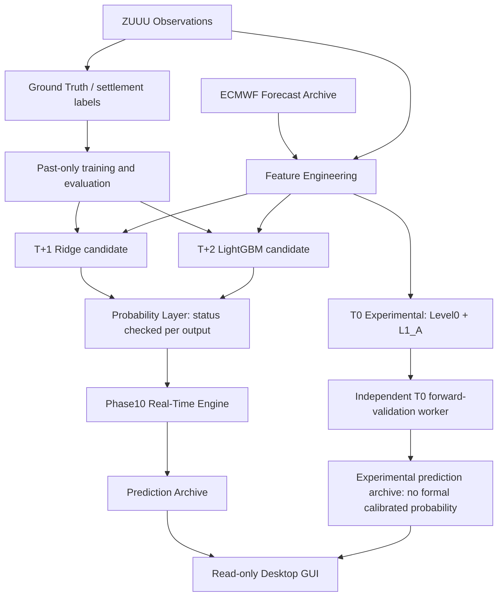

# ZUUU Prediction System

[中文](README.md) | [English](README_EN.md)

[](LICENSE)


[](CONTRIBUTING.md)
[](https://github.com/596986444zwt-dot/ZUUU_Prediction_System/actions/workflows/tests.yml)

成都双流国际机场（ZUUU）日最高温度预测与概率分析系统。

欢迎气象、机器学习、数据工程、桌面 GUI 和工程工具开发者参与。可以从 [good first issue](https://github.com/596986444zwt-dot/ZUUU_Prediction_System/issues?q=is%3Aissue%20is%3Aopen%20label%3A%22good%20first%20issue%22) 开始，也可以先阅读 [Roadmap](ROADMAP.md) 和 [贡献指南](CONTRIBUTING.md)。

## 项目截图


截图展示只包含公开跟踪文件的隔离副本中的预测卡片和图表，未读取生产数据库或真实前向数据。空白曲线和“暂无数据”为预期；本图不是运行证据、性能结果或验收结论。

## 当前开发状态

已公开历史数据处理、基线、MOS、特征、模型、概率协议、实时引擎、T0 前向验证和 GUI 的实现代码。Phase10 Soak 与 T0 真实前向样本积累仍需独立评价；开源发布不代表它们已验收通过。此仓库提供开发代码，不提供完整生产数据库或冻结模型资产。

## 项目目标

提供气象数据采集、时间与质量审计、特征构建、日最高温度预测、概率分布、前向验证与桌面展示的代码。强调预测发布时真实可用的信息、历史与实时状态的隔离，以及可追溯的结算过程。

## 系统架构与数据来源

机场 METAR/SPECI 观测来自 Aviation Weather Center；ECMWF 数值预报通过 Open-Meteo 获取。项目还包含辅助气象数据处理与历史数据构建代码。使用者应自行确认各来源的服务条款、访问限制与再分发权限；本仓库不分发运行数据。

数据流为：采集 → 原始归档与质量控制 → 特征 → 连续温度模型 → 概率协议 → 预测快照 → 日最高温结算与评价。Phase10 实时引擎、独立 T0 worker 与 GUI 分开；数据库 schema 和构建逻辑位于源码中。



图示为概念数据流：历史训练与运行时冻结模型加载分开；Ground Truth 标签仅在符合 as-of / settlement 规则后进入训练或评价。T0 不进入正式校准概率分支。

## 预测时效与模型状态

业务日期使用 `Asia/Shanghai`。T0 指当日，T+1（代码中的 T1）指次日，T+2（T2）指后日；issue、cutoff、观测时间、真实接收时间和标签可用时间分别记录。

T+1 当前正式候选为 Ridge，T+2 当前正式候选为 LightGBM；现有 Phase10 路径加载它们的冻结状态，并接续仅使用过去结果的 Phase9 概率协议。这里的 Production 指既有正式运行路径，不代表已承诺服务等级或已完成当前 Soak 验收。概率状态需逐条检查，可能为未校准、已校准、回退或无预测；不能把所有输出称为已校准。

T0 为 `T0_EXPERIMENTAL / FORWARD_VALIDATION`，包含 Level0 与 L1_A 候选方法。它不是正式 Champion，没有获准成为正式 T0 ML 模型或已校准概率。本 README 不宣称准确率；评价必须注明样本、日期范围、数据可用性和验证方式。

## 安装

建议在独立开发目录使用 Python 3.13，创建虚拟环境：

```powershell
git clone https://github.com/596986444zwt-dot/ZUUU_Prediction_System.git
cd ZUUU_Prediction_System
py -3.13 -m venv .venv
.\.venv\Scripts\Activate.ps1
python -m pip install numpy pandas scipy scikit-learn lightgbm requests pytest tzdata
python -m pip install -r src/gui/requirements.txt
```

仅运行公开测试时不需要模型或 GUI 依赖：`python -m pip install -r requirements-ci.txt`。Windows 激活脚本受策略限制时，可直接运行 `.\.venv\Scripts\python.exe -m pip ...`，不必更改系统执行策略。

GUI 依赖文件固定了 PySide6 版本。其余依赖尚无完整的版本锁定清单，上述安装是开发起点，不能视为已验证的跨平台可复现环境。打包工具仅在需要构建桌面应用时另行安装。

## 运行

`main.py` 仅打印项目配置信息。GUI 可在开发环境运行：

```powershell
python main.py
python -m src.gui.app
```

运行 CLI 示例（仅在你自己的开发副本中）：

```powershell
python scripts/phase10_realtime.py status
python scripts/t0_experimental.py status
python scripts/phase10_realtime.py start
python scripts/t0_experimental.py start
```

对应 CLI 也支持 `stop`。仓库保留启动、停止和状态 BAT，但这些 BAT 使用原部署机器的绝对 Python 路径；其他开发者应优先使用上面的虚拟环境命令。

**克隆仓库不等于复制生产部署。** Phase10 需要本地 Phase7/8/9 数据库、冻结模型状态及其 hash 校验资产（例如 `docs/phase8/model_states/`）；它们未上传。缺少资产时不能直接启动完整正式预测。历史构建、训练与审计工具可能写入数据库，执行前应检查入口并使用独立开发目录。T0 有独立配置和数据路径；启动会联网并创建自己的运行数据。

## 测试

在独立开发副本中先运行解析器单元测试：

```powershell
python -m pytest -p no:cacheprovider tests/test_zuuu_metar_parser.py tests/test_zuuu_metar_temperature_parser.py tests/test_zuuu_time_normalizer.py tests/test_zuuu_observation_record.py tests/test_zuuu_raw_identity.py -q
```

GitHub Actions 使用 Python 3.13 和最小依赖运行同一子集（解析器、业务日期、观测记录和内存数据库身份规则）。CI 不启动 worker 或 collector，不下载私有数据，不读取生产数据库。PR 使用只读权限，无部署或模型晋升步骤。

完整测试入口是 `python -m pytest tests`。部分集成、审计和 GUI 测试依赖未分发的历史数据库、模型或本地部署状态，需要自行准备隔离夹具；不保证干净克隆可直接通过完整测试。不要在正在运行 Soak 的正式目录中运行未确认副作用的测试。

Full production validation requires local frozen assets not included in the repository.

## 目录结构

| 目录/文件 | 用途 |
| --- | --- |
| `src/` | 采集、解析、数据库构建、特征、模型、概率、实时引擎与 GUI |
| `tests/` | 单元、集成和审计验证源码 |
| `scripts/` | CLI 与 Windows 管理脚本 |
| `config/` | 非敏感运行配置与项目设置 |
| `resources/` | 桌面展示资源 |
| `docs/` | 经过筛选的架构、时序、特征与实验协议 |
| `database/`, `raw/`, `data/`, `logs/`, `backups/` | 本地生成，Git 忽略 |

大型审计材料、证据包、原始数据、模型生成资产、IDE 配置与虚拟环境均留在本地。

## Roadmap

近期重点是 Phase10 运行验证、T0 30/60/90/180 有效日评价、ECMWF 可用性与延迟统计、概率校准研究和开发体验改进。详见 [ROADMAP.md](ROADMAP.md)。研究方向均需独立验证，不构成功能、日期或性能承诺。

## Contributing

请阅读 [CONTRIBUTING.md](CONTRIBUTING.md)，通过 Fork、分支与 Pull Request 参与，避免直接修改 `main`。涉及特征、模型、概率或时间语义的修改应附独立验证，不应自动晋升实验方法。

使用 [Bug / Feature / Research 表单](https://github.com/596986444zwt-dot/ZUUU_Prediction_System/issues/new/choose) 说明具体问题。请遵守 [社区行为规范](CODE_OF_CONDUCT.md)；凭证或敏感数据暴露应按 [SECURITY.md](SECURITY.md) 私下报告，不要发公开 Issue。

## License

This project is licensed under the MIT License. See the [LICENSE](LICENSE) file for details.

## Disclaimer

本项目用于研究和开发，可能存在延迟、缺失、数据修订、模型误差及概率失准。输出不构成官方气象预报、航空运行指令或投资建议。部署者负责数据许可、隔离测试、监控和使用风险；不得把历史回放结果等同于真实前向表现。
