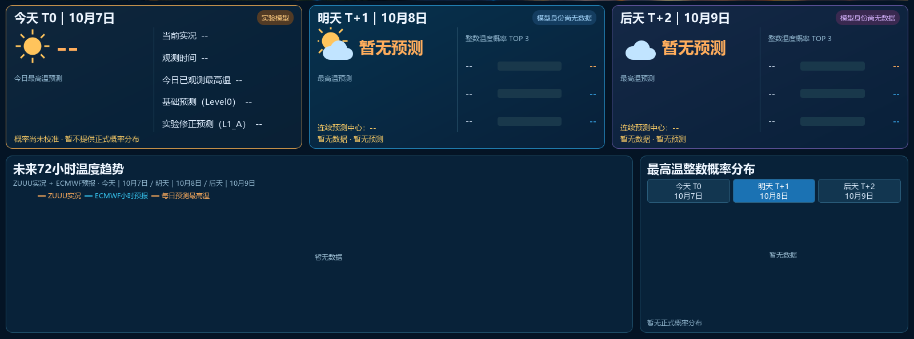
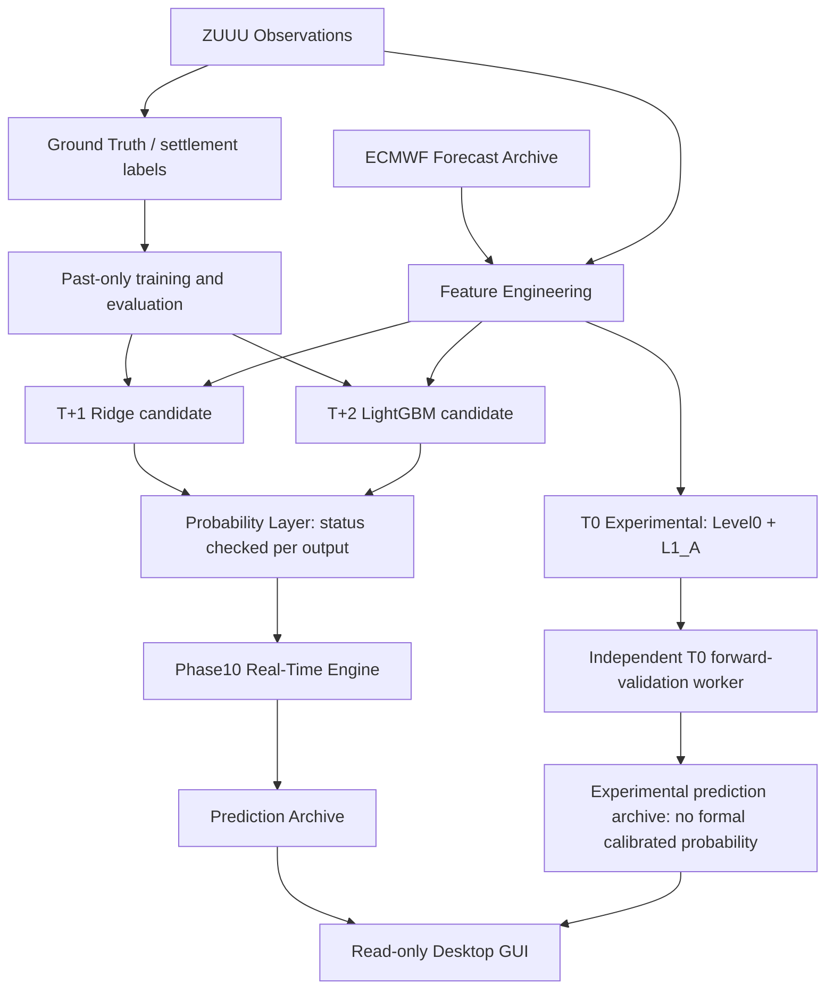

# ZUUU Prediction System

[中文](README.md) | [English](README_EN.md)

[](LICENSE)


[](CONTRIBUTING.md)
[](https://github.com/596986444zwt-dot/ZUUU_Prediction_System/actions/workflows/tests.yml)

Daily maximum temperature forecasting and probability analysis for Chengdu Shuangliu International Airport (ZUUU).

Contributions are welcome in meteorology, machine learning, data engineering, desktop UI, and developer tooling. Start with a [good first issue](https://github.com/596986444zwt-dot/ZUUU_Prediction_System/issues?q=is%3Aissue%20is%3Aopen%20label%3A%22good%20first%20issue%22), the [Roadmap](ROADMAP.md), or the [contribution guide](CONTRIBUTING.md).

## Desktop preview



Forecast cards and charts captured from an isolated copy containing public tracked files only. No production database or forward-validation data was read. Empty plots and unavailable forecasts are expected. This is a UI preview, not operational evidence, a performance result, or acceptance.

## Development status and goals

The repository contains implementations for historical observation processing, forecast archives, baselines, MOS, features, models, probability protocols, the real-time engine, T0 forward validation, and the desktop GUI. Phase10 operational soak and real T0 sample accumulation still require independent evaluation. Publishing the source does not certify operational acceptance.

The project prioritizes information actually available at forecast issuance, causal evaluation, separation of historical and live state, and traceable settlement. Production databases and frozen model assets are not distributed.

## Horizons and model status

Business dates use `Asia/Shanghai`. T0 means today, T+1 (T1 in code) tomorrow, and T+2 (T2) the following day. Issue time, cutoff, observation time, receipt time, and label eligibility are distinct.

| Horizon | Current method | Status |
| --- | --- | --- |
| T+1 | Ridge | Current formal candidate; the Phase10 path loads frozen states |
| T+2 | LightGBM | Current formal candidate; the Phase10 path loads frozen states |
| T0 | Level0 + L1_A | Experimental / Forward Validation; not a formal Champion |

The existing production path uses the past-only Phase9 probability protocol. Check every output's status: calibrated, uncalibrated, fallback, and no-forecast states are distinct. T0 has no authorized formal calibrated probability or formal ML Champion. No accuracy claim is made here; evaluation must specify samples, dates, availability rules, and validation design. “Production” describes an existing operational path, not an SLA or completed Soak acceptance.

## Architecture and source categories

Airport METAR/SPECI observations are obtained from Aviation Weather Center; ECMWF forecasts are accessed through Open-Meteo. Auxiliary meteorological and historical processing code is also included. Users must verify each source's terms, limits, and redistribution rights. Runtime data is not distributed.



This is a conceptual data flow. Historical training is separate from loading frozen runtime states. Labels enter training or evaluation only after their as-of and settlement conditions are satisfied. T0 remains outside the formal calibrated-probability branch. Schema and migration/build logic are in source code.

## Installation

Use Python 3.13 in a separate development checkout. Windows example:

```powershell
git clone https://github.com/596986444zwt-dot/ZUUU_Prediction_System.git
cd ZUUU_Prediction_System
py -3.13 -m venv .venv
.\.venv\Scripts\Activate.ps1
python -m pip install numpy pandas scipy scikit-learn lightgbm requests pytest tzdata
python -m pip install -r src/gui/requirements.txt
```

For public tests only, install `requirements-ci.txt`; model and GUI dependencies are unnecessary. If activation is blocked by Windows policy, invoke `.\.venv\Scripts\python.exe` directly instead of changing system policy. On Linux/macOS, create the environment with `python3.13 -m venv .venv` and activate it with `source .venv/bin/activate`.

PySide6 is pinned in the GUI dependency file. A complete production dependency lock is not available yet; the general installation commands are a development starting point, not a verified reproducible production environment. Install packaging tools separately when needed.

## Running

`main.py` prints project configuration; it does not run the prediction engine.

```powershell
python main.py
python -m src.gui.app
python scripts/phase10_realtime.py status
python scripts/t0_experimental.py status
```

In your own isolated development deployment, engine commands include:

```powershell
python scripts/phase10_realtime.py start
python scripts/t0_experimental.py start
```

Both CLIs also support `stop`. Existing Windows BAT files use the original deployment's absolute interpreter path; new developers should use their virtual environment instead.

**A clone is not a complete production deployment.** Phase10 needs local Phase7/8/9 databases and hash-verified frozen states, including assets under `docs/phase8/model_states/`; these are excluded. Missing assets prevent a full formal forecast deployment. Review historical build, training, and audit entry points before running them: they may write databases. T0 uses separate configuration and paths; starting it makes network requests and creates runtime data.

## Testing and CI

Install minimal dependencies and run the public subset in a development checkout:

```powershell
python -m pip install -r requirements-ci.txt
python -m pytest -p no:cacheprovider tests/test_zuuu_metar_parser.py tests/test_zuuu_metar_temperature_parser.py tests/test_zuuu_time_normalizer.py tests/test_zuuu_observation_record.py tests/test_zuuu_raw_identity.py -q
```

GitHub Actions runs these parser, business-date, observation-record, and in-memory identity tests on Python 3.13. It uses read-only repository permissions and does not launch workers/collectors, fetch private data, access production databases, deploy, or promote models.

Full production validation requires local frozen assets not included in the repository.

The full entry point is `python -m pytest tests`. Some integration, audit, and GUI tests need isolated local historical/model fixtures and deployment state. A fresh clone is not expected to pass the entire suite without those assets. Do not run unchecked integration tests in an active production Soak directory.

## Repository layout

| Path | Purpose |
| --- | --- |
| `src/` | Collectors, parsers, database builders, features, models, probability, real-time engine, GUI |
| `tests/` | Unit, integration, and audit verification source |
| `scripts/` | CLI and Windows management scripts |
| `config/` | Non-secret settings |
| `resources/` | Desktop resources |
| `docs/` | Selected architecture, timing, feature, and experiment protocols |
| `.github/` | Issue/PR templates, CI, and the public GUI preview |
| `database/`, `raw/`, `data/`, `logs/`, `backups/` | Local runtime outputs, ignored by Git |

Large audit exports, evidence bundles, generated model assets, IDE state, and virtual environments stay local.

## Roadmap

Priorities include Phase10 operational evaluation, T0 30/60/90/180 valid-day milestones, ECMWF availability and delay statistics, probability calibration research, and developer experience. See [ROADMAP.md](ROADMAP.md). Research ideas are conditional on independent evidence, not feature, schedule, or performance promises.

## Contributing

Follow [CONTRIBUTING.md](CONTRIBUTING.md): Fork, create a branch, test, and open a Pull Request to `main`. Model, feature, probability, or time-semantics changes need independent validation; experimental methods must not be promoted automatically.

Use the [Bug / Feature / Research forms](https://github.com/596986444zwt-dot/ZUUU_Prediction_System/issues/new/choose). Follow the [Code of Conduct](CODE_OF_CONDUCT.md). Report credential or sensitive-data exposure privately as described in [SECURITY.md](SECURITY.md), never in a public Issue.

## License

This project is licensed under the [MIT License](LICENSE).

## Disclaimer

This is research and development software. Data can be delayed, missing, or revised; forecasts can be wrong and probabilities miscalibrated. Outputs are not official weather forecasts, aviation instructions, or investment advice. Operators are responsible for data licensing, isolated validation, monitoring, and deployment risk. Historical replay results are not equivalent to genuine forward performance.
